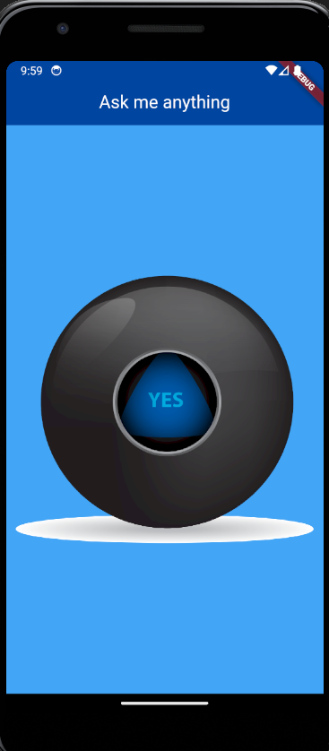

# Magic Ball

Welcome to the Magic 8-Ball Flutter App – your go-to Flutter application for those hard-to-make decisions! Just ask a question, tap the button, and let the magic 8-ball guide your fate.



## About The Project

The Magic 8-Ball App is a fun, interactive way to make everyday decisions with a bit of unpredictability. From the course The Complete Flutter Development Bootcamp with Dart by Angela Yu, this app brings the magic 8-ball experience right to your smartphone.

## Features

- **Sleek Design**: A clean and intuitive interface for an engaging user experience.
- **Randomized Answers**: With multiple possible answers, each tap brings a new perspective.

## Widgets Used

In this project, we've used a number of Flutter's versatile widgets to bring our Magic 8-Ball App to life:

- `AppBar`: A Material Design app bar that provides identity and action control to our app.
- `Column`: A vertical arrangement for our app's body content.
- `Expanded`: A flexible widget that expands to fill the available space in our `Column`.
- `TextButton`: A simple button to detect taps that also provides feedback.

### Why These Widgets?

Each widget was selected for its role in creating a seamless and effective user experience:

- `AppBar` offers a familiar and accessible way for users to navigate and understand the app's purpose.
- `Column` and `Expanded` work together to manage layout and presentation, ensuring our magic 8-ball remains center stage.
- `TextButton` is an accessible, intuitive control for users to interact with the magic 8-ball.

## Getting Started

To get a local copy up and running, follow these simple steps:

1. Clone the repo
   ```sh
   git clone https://github.com/ogeeDeveloper/magic_ball.git
   ```
2. Navigate to the project directory
   ```sh
   cd magic_ball
   ```
3. Install the dependencies
   ```sh
   flutter pub get
   ```
4. Run the app
   ```sh
   flutter run
   ```

## Contributing

Contributions are what make the open-source community such a fantastic place to learn, inspire, and create. Any contributions you make are greatly appreciated.

1. Fork the Project
2. Create your Feature Branch (git checkout -b feature/AmazingFeature)
3. Commit your Changes (git commit -m 'Add some AmazingFeature')
4. Push to the Branch (git push origin feature/AmazingFeature)
5. Open a Pull Request
